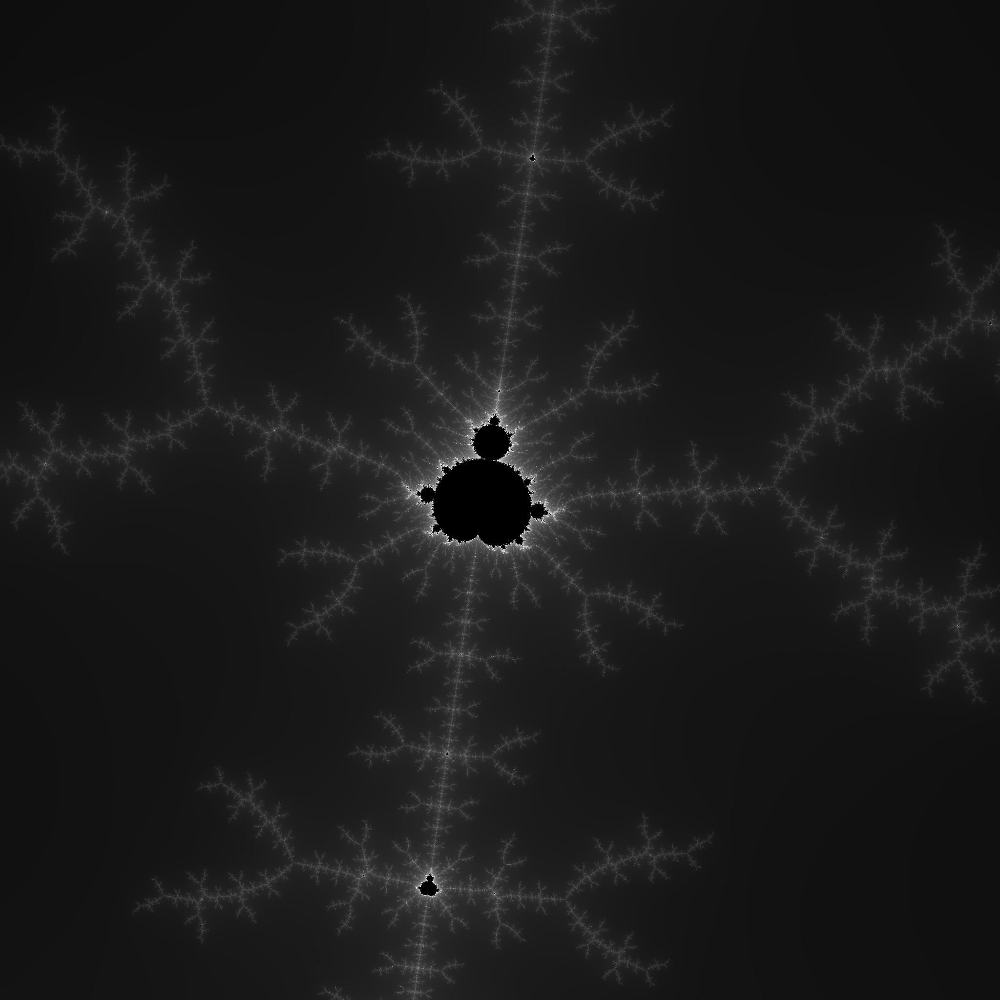

# Mandelbrot Explorer

A desktop application for exploring the Mandelbrot set. The project is written in Rust and uses **winit**, **wgpu**, **tokio**, and **portable\_simd** for high performance rendering.

## Features

- Interactive pan and zoom
- CPU fractal calculations using 64‑bit precision
- Multithreaded with SIMD acceleration
- GPU based preview during navigation

## Requirements

The project targets the Rust nightly toolchain (tested with nightly 1.77.2) for SIMD support.

## Benchmark

Rendering a single‑threaded 2048×2048 image with 1024 iterations takes about 135 ms on a MacBook Air M2 2022.

## Demo

Additional screenshots can be found in the `doc/` directory:

## License

This project is licensed under the MIT License. See [LICENSE](LICENSE) for details.
